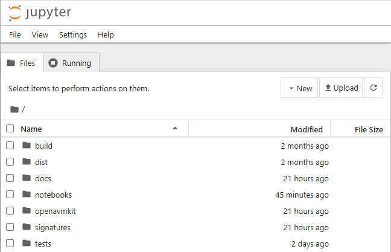
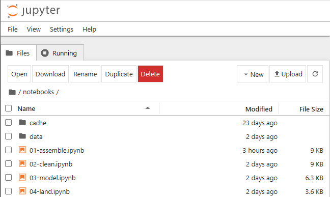
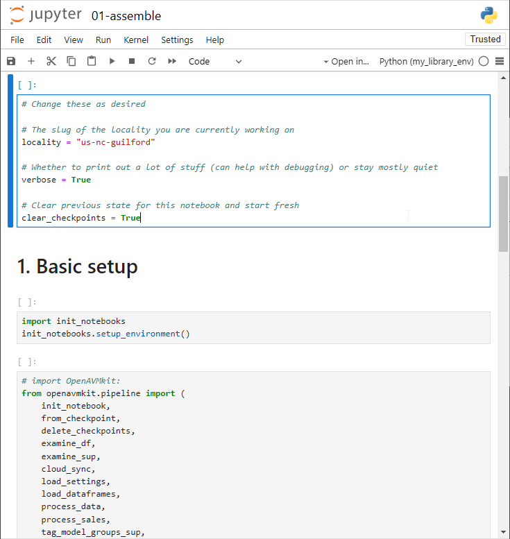

# OpenAVMKit

Open AVM kit is a python library for real estate mass appraisal. It includes modules for data cleaning, data enrichment, modeling, and statistical evaluation of predictive models. It also includes Jupyter notebooks that model typical workflows.

# Table of Contents

- [Installation](#installation)
- [Quick start](#quick-start)
- [Usage](#usage)
  - [Using the code modules](#using-the-code-modules)
  - [Using the Jupyter notebooks](#using-the-jupyter-notebooks)
  - [Configuring cloud storage](#configuring-cloud-storage)
  - [Configuring pdf report generation](#configuring-pdf-report-generation)
- [Running tests](#running-tests)
- [Contributing](CONTRIBUTING.md)
- [License](LICENSE)

# Installation

Follow these steps to install and set up `OpenAVMKit` on your local environment.

## 1. Clone the Repository

Start by cloning the repository to your local machine:

_(This command is the same on Windows, MacOS, and Linux):_
```bash
git clone https://github.com/larsiusprime/openavmkit.git
cd openavmkit
```

This command will clone the repository to your local machine, store it under a folder named `openavmkit/`, and then navigate to that folder.

## 2. Install Python

If you don't have Python on your machine, you'll need to install it.

The specific version of Python that openavmkit has been tested on is:
> 3.12.9

You can download that version of Python [here](https://www.python.org/downloads/release/python-3129/).

If you already have Python installed, but you're not sure which version of Python you have installed, you can check by running this command:

```bash
python --version
```

If you have Python installed, you should see the version number printed to the console.

If you have the wrong version of Python installed, you can download the correct version from the link above, and then install it. Be very careful to make sure that the new version of Python is available in your `PATH`. (If you don't know what the means, here is a [handy tutorial on the subject](https://realpython.com/add-python-to-path/)).


## 3. Set up a Virtual Environment

It's a good practice to create a virtual environment* to isolate your Python dependencies. Here's how you can set it up using `venv`, which is Python's built-in tool ("venv" for "virtual environment"):

_MacOS/Linux:_
```bash
python -m venv venv
source venv/bin/activate
```

_Windows:_
```bash
python -m venv venv
venv\Scripts\activate
```

*_On a typical computer, there will be other programs that are using other versions of python and/or have their own conflicting versions of libraries that `openavmkit` might also need to use. To keep `openavmkit` from conflicting with your existing setup, we set up a 'virtual environment,' which is like a special bubble that is localized just to `openavmkit`. In this way `openavmkit` gets to use exactly the stuff it needs without messing with whatever else is already on your computer._

Let me explain a little bit what's going on here. The first command, `python -m venv venv`, _creates_ the virtual environment. You only have to run that once. The second command, the bit that ends with `activate`, is what actually _starts_ the virtual environment. You have to run that every time you open a new terminal window or tab and want to work on `openavmkit`.

You can tell that you are in the virtual environment, because your command prompt will change to show the name of the virtual environment, which in this case is `venv`. Here's how your command prompt will look inside and outside the virtual environment.

**Outside the virtual environment:**

_MacOS/Linux:_
```bash
/path/to/openavmkit$
```

_Windows:_
```bash
C:\path\to\openavmkit>
```

**Inside the virtual environment:**

_MacOS/Linux:_
```bash
(venv) /path/to/openavmkit$
```

_Windows:_
```bash
(venv) C:\path\to\openavmkit>
```

Take careful note that you are actually inside the virtual environment when running the following commands.

When you are done working on `openavmkit` and want to leave the virtual environment, you can run this command:

```bash
deactivate
```

And you will return to your normal command prompt.

## 4. Install dependencies

`openavmkit` uses a bunch of third-party libraries that you need to install. Python lets us list these in a text files so you can install them with one command. Here's how you can do that, using python's built-in `pip` tool, which manages your python libraries:

```bash
pip install -r requirements.txt
```

Then there's another dependency you have to install manually, ignore the warnings it gives you, it's fine:
```bash
pip install tabulate --upgrade
```

# Quick Start

Once you've set up your python environment and dependencies, here's the basic guide to get you started:

## 1. Install `openavmkit`

If you want to import and use the code modules directly, you must install the library. 

First, make sure you've followed the above steps. 

Then, in your command line environment, make sure you are in the top level of the `openavmkit/` directory. That is the same directory which contains the `setup.py` file.

To install `openavmkit` in editable mode (so you can make changes to the library and see them reflected in your code), run this command:
  ```bash
  pip install -e .
  ```

To install `openavmkit` in normal mode, run this command:
  ```bash
  pip install .
  ```

The "." in that command is a special symbol that refers to the current directory. So when you run `pip install .`, you are telling `pip` to install the library contained in the current directory. That's why it's important to make sure you're in the right directory when you run this command!


## 2. Running Jupyter notebooks

Jupyter is a popular tool for running Python code interactively. We've included a few Jupyter notebooks in the `notebooks/` directory that demonstrate how to use `openavmkit` to perform common tasks.

To start using the Jupyter notebooks, you'll first need to have Jupyter installed. That should have already been taken care of in the requirements section above, but if you need to install it, you can do so with this command:

```bash
pip install jupyter
```

With Jupyter installed, you can start the Jupyter notebook server* by running this command:

```bash
jupyter notebook
```

_*What's a "Jupyter notebook server?" Well, a "server" is any program that talks to other programs over a network. In this case the "network" is just your own computer, and the "other program" is your web browser. When you run `jupyter notebook`, you're starting a server that talks to your web browser, and as long as it is running you can use your web browser to interact with the Jupyter notebook interface._

When you run `jupyter notebook`, it will open a new tab in your web browser that shows a list of files in the current directory. You can navigate to the `notebooks/` directory and open any of the notebooks to start running the code.

# Usage

## Using the code modules

Here's how you can import and use the core modules directly in your own Python code.

For instance, here's a simple example that demonstrates how to calculate the Coefficient of Dispersion (COD) for a list of ratios:

```python
import openavmkit

ratios = [0.8, 0.9, 1.0, 1.1, 1.2]
cod = openavmkit.utilities.stats.calc_cod(ratios)
print(cod)
```

You can also specify the specific module you want to import:

```python
from openavmkit.utilities import stats

ratios = [0.8, 0.9, 1.0, 1.1, 1.2]
cod = stats.calc_cod(ratios)
```

Or even import specific functions directly:

```python
from openavmkit.utilities.stats import calc_cod

ratios = [0.8, 0.9, 1.0, 1.1, 1.2]
cod = calc_cod(ratios)
```

## Using the Jupyter Notebooks

The `notebooks/` directory contains several pre-written Jupyter notebooks that demonstrate how to use the library interactively. These notebooks are especially useful for new users, as they contain step-by-step explanations and examples.

1. Launch the Jupyter notebook server:
```bash
jupyter notebook
```

This should open a new tab in your web browser with the Jupyter interface.



2. Navigate to the `notebooks/` directory in the Jupyter interface and open the notebook you want to run.



Double-click on your chosen notebook to open it.



For information on how to use Jupyter notebooks in general, refer to the [official Jupyter notebook documentation](https://jupyter-notebook.readthedocs.io/en/stable/).

## Configuring Census API Access

OpenAVMKit can enrich your data with Census information using the Census API. To use this feature, you'll need to:

1. Get a Census API key from [api.census.gov/data/key_signup.html](https://api.census.gov/data/key_signup.html)
2. Add your Census API key to the `.env` file in the `notebooks/` directory

### Getting a Census API Key

1. Visit [api.census.gov/data/key_signup.html](https://api.census.gov/data/key_signup.html)
2. Fill out the form with your information
3. Agree to the Census terms of service
4. You will receive your API key via email

### Configuring the Census API Key

Add your Census API key to the `.env` file in the `notebooks/` directory:

```
CENSUS_API_KEY=your_api_key_here
```

### Using Census Enrichment

To enable Census enrichment in your locality settings, add the following to your `settings.json`:

```json
{
  "process": {
    "enrich": {
      "universe": {
        "census": {
          "enabled": true,
          "year": 2022,
          "fips": "24510",
          "fields": [
            "median_income",
            "total_pop"
          ]
        }
      }
    }
  }
}
```

Key settings:
- `enabled`: Set to `true` to enable Census enrichment
- `year`: The Census year to query (default: 2022)
- `fips`: The 5-digit FIPS code for your locality (state + county)
- `fields`: List of Census fields to include

The Census enrichment will automatically join Census block group data to your parcels using spatial joins, adding demographic information to your dataset.

## Creating a new locality

OpenAVMKit operates on the concept of a "locality", which is a geographic area that contains a set of properties. This can represent a city, a county, a neighborhood, or any other region or jurisdiction you want to analyze. To set one up, create a folder like this within openavmkit's `notebooks/` directory:

```
data/<locality_slug>/
```

Where `<locality_slug>` is a unique identifying name for your locality in a particularly opinionated format. That format is:

```
<country_code>-<state_or_province_code>-<locality_name>
```

- **Country code**: The 2-letter country code according to the [ISO 3166-1 standard](https://en.wikipedia.org/wiki/ISO_3166-1_alpha-2). For example, the country code for the United States is `us`, and the country code for Norway is `no`.

- **State/province code**: The 2-letter state or province code according to the [ISO 3166-2 standard](https://en.wikipedia.org/wiki/ISO_3166-2). For example, the state code for Texas is `tx`, and the state code for California is `ca`.

- **Locality name**: A human-readable name for the locality itself. This follows no particular standard and is entirely up to you.

The slug itself should be all lowercase and contain no spaces or special characters other than underscores.

Some examples:

```
us-nc-guilford    # Guilford County, North Carolina, USA
us-tx-austin      # City of Austin, Texas, USA
no-03-oslo        # City of Oslo, Norway
no-50-orkdal      # Orkdal kommune (county), Norway
```

Once you have your locality set up, you will want to set it up like this (using `us-nc-guilford` as an example):

```
data/
├──us-nc-guilford/
    ├── in/
    ├── out/
    ├── settings.json
```

The `in/` directory is where you will put your raw data files.   
The `out/` directory is where the output files will be saved.  
The `settings.json` file will drive all your modeling and analysis decisions for the library. For now you can just put a blank `{}` in there so that it will load, but you will want to consult the documentation / tutorials for how to construct this file.


## Configuring cloud storage

`openavmkit` includes a module for working with remote storage services. At this time the library supports three cloud storage methods:

- Microsoft Azure
- Hugging Face
- SFTP

To configure cloud storage, you will need to create a file that stores your connection credentials (such as API keys or passwords). This file should be named `.env` and should be placed in the `notebooks/` directory.  

This file is already ignored by git, but do make sure you don't accidentally commit this file to the repository or share it with others, as it contains your sensitive login information!

This file should be a plain text file formatted like this:
```
SOME_VARIABLE=some_value
ANOTHER_VARIABLE=another_value
YET_ANOTHER_VARIABLE=123
```

That's just an example of the format; here are the actual variables that it recognizes:

| Variable Name                     | Description                                                                                                                                                             |
|-----------------------------------|-------------------------------------------------------------------------------------------------------------------------------------------------------------------------|
| `CLOUD_TYPE`                      | The type of cloud storage to use.<br>Legal values are: `azure`, `huggingface`, `sftp`. You can also set this value per-project in your `settings.json` as `cloud.type`. |
| `AZURE_ACCESS`                    | The type of access your azure account has.<br>Legal values are: `read_only`, `read_write`.                                                                              |
| `AZURE_STORAGE_CONTAINER_NAME`    | The name of the Azure storage container                                                                                                                                 |
| `AZURE_STORAGE_CONNECTION_STRING` | The connection string for the Azure storage account                                                                                                                     |
| `HF_ACCESS`                       | The type of access your huggingface account has.<br>Legal values are: `read_only`, `read_write`.                                                                        |
| `HF_TOKEN`                        | The Hugging Face API token                                                                                                                                              |
| `HF_REPO_ID`                      | The Hugging Face repository ID                                                                                                                                          |
| `SFTP_ACCESS`                     | The type of access your SFTP account has.<br>Legal values are: `read_only`, `read_write`.                                                                               |
| `SFTP_HOST`                       | The hostname of the SFTP server                                                                                                                                         |
| `SFTP_USERNAME`                   | The username for the SFTP server                                                                                                                                        |
| `SFTP_PASSWORD`                   | The password for the SFTP server                                                                                                                                        |
| `SFTP_PORT`                       | The port number for the SFTP server                                                                                                                                     |

You only need to provide values for the service that you're actually using. For instance, here's what the file might look like if you are using Hugging Face:

```
CLOUD_TYPE=huggingface
HF_ACCESS=read_write
HF_REPO_ID=landeconomics/localities-public
HF_TOKEN=<YOUR_HUGGING_FACE_API_TOKEN>
```

If you're just getting started, you can just use read-only access to an existing public repository. Here's an example of how to access the public datasets provided by the [The Center for Land Economics](https://landeconomics.org):

```
CLOUD_TYPE=huggingface
HF_ACCESS=read_only
HF_REPO_ID=landeconomics/localities
```

This will let you download the inputs for any of the Center for Land Economics' public datasets. Note that you will be unable to upload your changes and outputs to repositories that you have read-only access to.

If you want to sync with your own cloud storage, you will need to set up your own hosting account and then provide the appropriate credentials in the `.env` file.

If you have multiple projects stored on different cloud services, you can set the `CLOUD_TYPE` and `CLOUD_ACCESS` variables in your settings.json. This will allow you to switch between cloud services on a per-project basis. **Do not ever store credentials in your settings.json, however, as these are uploaded to the cloud!**

## Configuring PDF report generation

`openavmkit` includes a module for generating PDF reports. This module uses the `pdfkit` library, which is a Python wrapper for the `wkhtmltopdf` command line tool. Although `pdfkit` will be installed automatically along with the rest of the dependencies, you will need to install `wkhtmltopdf` manually on your system to use this feature. If you skip this step, don't worry, you'll still be able to use the rest of the library, it just won't generate PDF reports. 

### Installing wkhtmltopdf:

#### Manual installation

Visit the [wkhtmltopdf download page](https://wkhtmltopdf.org/downloads.html) and download the appropriate installer for your operating system.

#### Windows

1. Download the installer linked above
2. Run the installer and follow the instructions
3. Add the `wkhtmltopdf` installation directory to your system's PATH environment variable

If you don't know what 3. means:

The idea is that you want the `wkhtmltopdf` executable to be available from any command prompt, so you can run it from anywhere. For that to work, you need to make sure that the folder that the `wkhtmltopdf` executable is in is listed in your system's PATH environment variable.

Here's how to do that:

1. Find the folder where `wkhtmltopdf` was installed. It's probably in `C:\Program Files\wkhtmltopdf\bin`, but it could be somewhere else. Pay attention when you install it.
2. Follow this [tutorial](https://web.archive.org/web/20250131024033/https://www.architectryan.com/2018/03/17/add-to-the-path-on-windows-10/) to edit your PATH environment variable. You want to add the folder from step 1 to the PATH variable.
3. Open a new command prompt and type `wkhtmltopdf --version`. If you see a version number, you're all set!

#### Linux

On Debian/Ubuntu, run:

```bash
sudo apt-get update
sudo apt-get install wkhtmltopdf
```

#### macOS

Ensure you have [Homebrew](https://brew.sh) installed. Then run:

```bash
brew install wkhtmltopdf
```

# Running tests

To ensure everything is working properly, you can run the test suite. This will execute all unit tests from the `tests/` directory.

Run the tests using `pytest`:

```bash
pytest
```

This will run all the unit tests and provide feedback on any errors or failed tests.